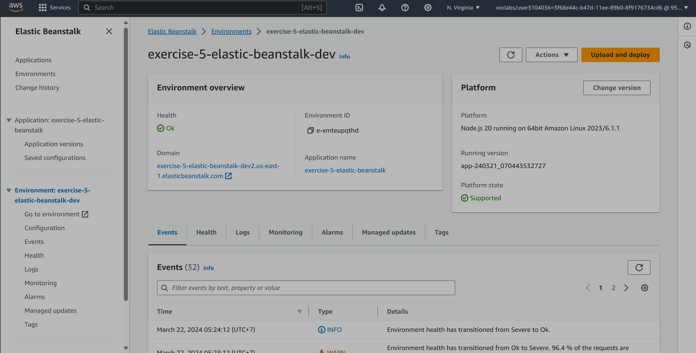

# udacity-tweets-app

This is a simple tweeter like application server.

***
## Project Submission Checklist

### The project uses AWS Elastic Beanstalk’s CLI and Console Dashboard

- [x] The project was deployed using the AWS Elastic Beanstalk CLI eb init, eb create, and eb deploy commands.

- [x] A screenshot of the elastic beanstalk application dashboard is included in a ``` deployment_screenshot``` directory.


### The project includes functional cloud deployments

- [x] An endpoint URL for a running elastic beanstalk deployment (http://exercise-5-elastic-beanstalk-dev2.us-east-1.elasticbeanstalk.com/) has been submitted along with the project submission. This endpoint responds to valid GET requests including: 
[Example link](http://exercise-5-elastic-beanstalk-dev2.us-east-1.elasticbeanstalk.com/filteredimage?image_url=https://upload.wikimedia.org/wikipedia/commons/b/bd/Golden_tabby_and_white_kitten_n01.jpg)

## Getting Setup

### Installing project dependencies

This project uses NPM to manage software dependencies. NPM Relies on the package.json file located in the root of this repository. After cloning, open your terminal and run:
```bash
npm install
```
>_tip_: **npm i** is shorthand for **npm install**

***

## Running the Server Locally
To run the server locally in developer mode, open terminal and run:

`npm start` or `node server`

***
## Important Files and Project Structure

The source code for this demo resides in the ./src directory.

#### Test URL
http://localhost:8080/

## Curl commands

#### Get tweet by id
```
curl --location 'http://localhost:8080/tweets/1'
```

#### Get list of tweets
```
curl --location 'http://localhost:8080/tweets'
```

#### Get list of tweets filtered by author
```
curl --location 'http://localhost:8080/tweets?author=Michael'
```

#### Create a new tweet
```
curl --location 'http://localhost:8080/tweets' \
--header 'Content-Type: application/json' \
--data '{
    "author": "Elisabeth",
    "text": "This is the cutest puppy I have ever seen!",
    "imgUrl": ""
}'
```

#### Uploading image
```
curl --location 'http://localhost:8080/images' \
--form 'file=@"./puppy.jpeg"'                
{"url":"https://user3104036project2bucket.s3.amazonaws.com/1710924649263_file_puppy.jpeg"}     
```